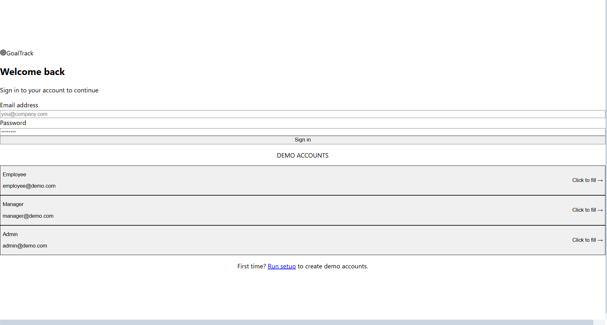
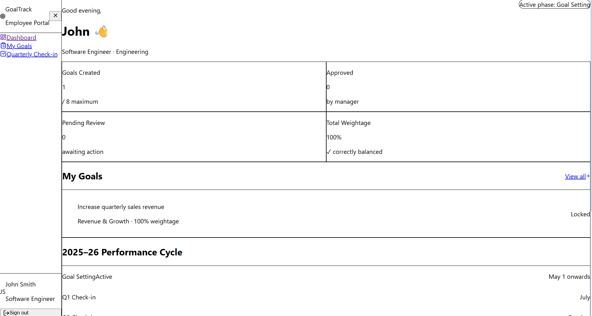
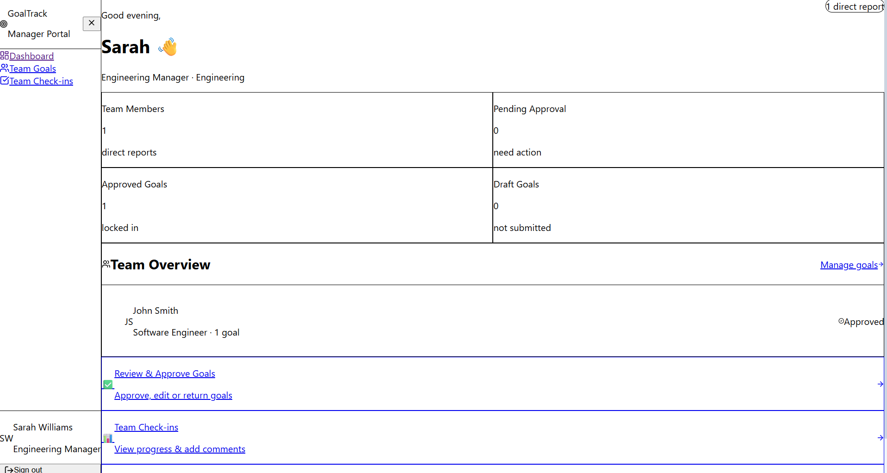
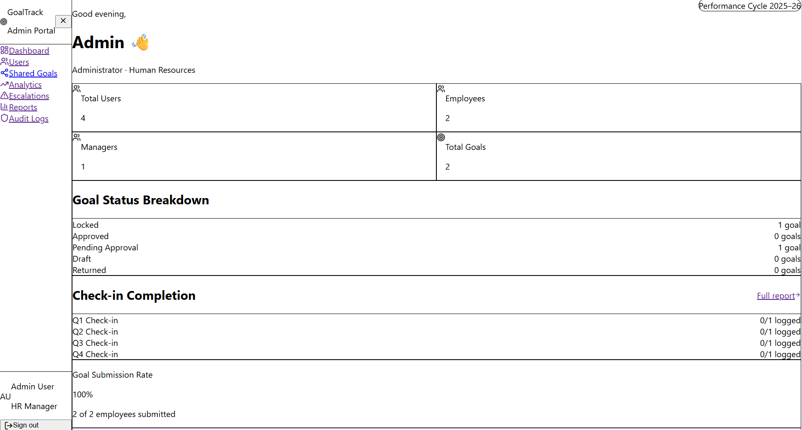

# GoalTrack - Performance Management Portal

A full-stack performance management portal designed to streamline goal setting, employee check-ins, team monitoring, and administrative reporting within organizations.

## 🌐 Live Demo

https://goal-tracker-apkk8psju-prathmesh-khodes-projects.vercel.app/login

---

## 📌 Overview

GoalTrack is a role-based web application that enables employees, managers, and administrators to manage organizational performance effectively.

The system supports:

- Goal creation and tracking
- Periodic employee check-ins
- Team performance monitoring
- User and role management
- Reports and analytics
- Audit logs and escalation workflows

This project demonstrates a production-ready application with authentication, protected routes, responsive dashboards, and cloud deployment.

---

## ✨ Features

### 👤 Employee Portal
- Personal dashboard
- Create and manage goals
- Submit progress check-ins
- Track completion status

### 👔 Manager Portal
- Team dashboard
- Review team goals
- Monitor employee progress
- Conduct manager check-ins

### 🔑 Admin Portal
- User management
- Reports generation
- Audit logs
- Analytics dashboard
- Escalation management
- Shared goals

### 🔐 Authentication
- Firebase Authentication
- Role-based access control
- Protected routes

### ☁️ Deployment & Monitoring
- Hosted on Vercel
- Vercel Analytics
- Vercel Speed Insights

---

## 🛠️ Tech Stack

### Frontend
- React
- Vite
- Tailwind CSS
- React Router DOM
- React Hot Toast
- Lucide React

### Backend & Database
- Firebase Authentication
- Cloud Firestore

### Deployment
- Vercel

---

## 👥 Demo Credentials

| Role | Email | Password |
|------|------|------|
| Admin | admin@demo.com | Demo@123 |
| Manager | manager@demo.com | Demo@123 |
| Employee | employee@demo.com | Demo@123 |
| Employee 2 | employee2@demo.com | Demo@123 |

---

## 📸 Screenshots

### Login Page


### Employee Dashboard


### Manager Dashboard


### Admin Dashboard


---

## 📂 Project Structure

```text
goal-tracker/
├── src/
│   ├── components/
│   ├── contexts/
│   ├── firebase/
│   ├── pages/
│   │   ├── employee/
│   │   ├── manager/
│   │   └── admin/
│   ├── App.jsx
│   ├── main.jsx
│   └── index.css
├── screenshots/
├── .env.example
├── package.json
├── vite.config.js
└── README.md
